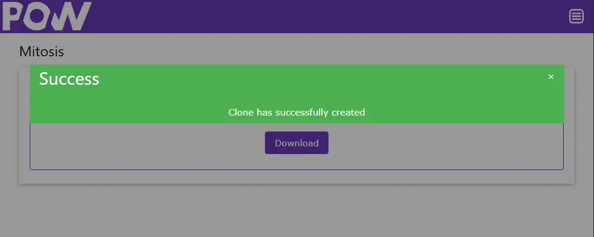
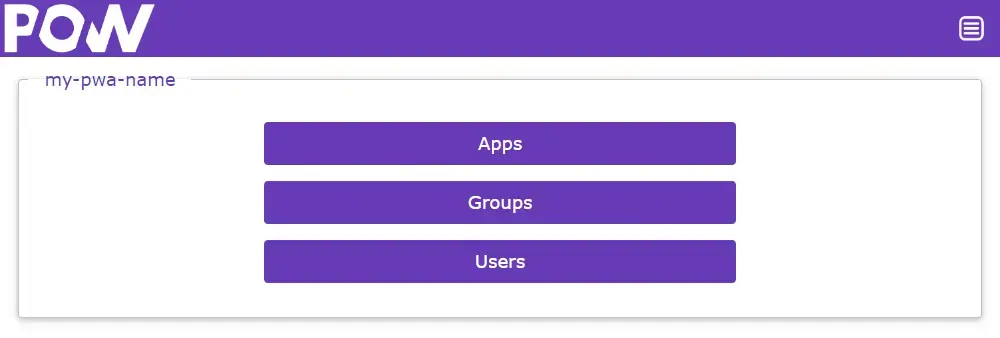

# WebpoW 

## Overview

This project is a content management system designed to create a Progressive Web App development platform and provide a simple way to manage applications, groups and users. WebpoW also enables the creation of content using artificial intelligence to reduce project development time.

Its development was designed to facilitate the creation of a structure that serves as a starting point for developing web applications using HTML and JavaScript without the need to develop an access control structure.  The project uses the Google Firebase structure and the Spark plan, which is free, so it is possible to develop a minimum viable product without having to invest in infrastructure.|

## Why use?

The project is 100% free and only requires a little knowledge about the Google Firebase tool and can be implemented easily.

## What I need?

You must have a Google account, preferably <b>without</b> billing activated.

If billing is enabled you may be charged for the project.

## What should I know?

To be able to implement the system it is necessary to have some knowledge of the Google Firebase platform, as it will serve as the basis for WebpoW.

Some parts of the installation process are easier to do directly in the Firebase console, you will only need the Firebase CLI to upload the files to the server, then you will need to have Node JS installed in your development environment.

To develop your applications you need knowledge of HTML and JavaScript, however you can add the framework of your choice to carry out the development.

## Start using now!

### Configuring the application environment in Google Firebase

1. Access the [firebase console](https://console.firebase.google.com/) and create a project by clicking on "Add project".

- Add a name to your project.
- Leave Google Analytics activated.
- Select an account for Analytics and click create project.

2. After creating your project, you must create a web application, to do this click on the icon </> on the phrase "Add an app to get started".

- On the next screen, fill in your application details and add Firebase Hosting to your application. 
- You can skip step 2 of creating "Add Firebase SDK". 
- Install the Firebase CLI on your computer, it will be useful for deploying your files. 
- In step 4, just log in, the files will be sent later.

3. Now that the hosting is created, it is necessary to activate user authentication using email and password. To do this, access the Google Authentication configuration page (https://console.firebase.google.com/project/YOUR-PROJECT-NAME/authentication) and click "Get Started".

- Click on the "Email/Password" button.

  
- Then activate Email/Password authentication and click save.

4. All your project information and systems will be stored in a Firestore database, you must activate it at https://console.firebase.google.com/project/YOUR-PROJECT-NAME/firestore and click "Create Database".

- Select the region where your database will be created and in the security rules preferences select the **"Start in test mode"** option and click Create.

<b>Ready! The Google Firebase Environment is now ready to receive your application.</b>

### Clone WebpoW using the mitosis application.

Now that you have created the environment for WebpoW, it is time to create your copy of the system.

1. The first is to access your app settings in your Firebase project settings. This can be done by clicking on the gear icon and then on the "Project Settings" option.

2. Find the "SDK setup and configuration" option for your web application at the bottom of the "General" page and check the "Config" option and copy the data to the clipboard.

3. After copying the project settings, access the Mitosis tool of the system [WebpoW](https://webpow.web.app/#mitosis) available at: https://webpow.web.app/#mitosis

4. Fill in your project data:

- Project Name: enter the name of your project, it will be used in the title tag.
- Project Description: write a short description of your project for the description meta tag.
- Keywords: choose the words for the keywords meta tag on your website.
- Author: Your name or the name of your company.
- Email: Will be used to log in to the system as an administrator after activation.
- Password: password for the email above. Write down the data.
- Connection String: Paste your project settings here, the ones you copied initially.
- Gemini Key: Generate your key for Kiai here at https://aistudio.google.com/app/apikey.

5. Now you need to adjust the layout details of your new system, to do this click on the images to replace them and change the theme and background colors of your system.

- Logo: The image will be adjusted to a fixed height and resized proportionally.
- Theme color and background: You will select the basic colors of your project, change the values ​​and have fun.
- Manifest logo: These images will be used to make the icons for your application, for this you need to send a square image. The image inside the circle is used to check how it will look when cut, increase the edges of the image so that it fits the circle.

6. When all information has been changed, click "Clone".

7. Close the warning box and click download and save your files to deploy. The files created have unique keys compatible only with your project, so keep these files well.

8. After unzipping the files, deploy your project through the Firebase CLI using the command:

- Firebase login: Login to the Firebase CLI
- Firebase deploy: sends the files and configures the environment.

9. The system will take a few minutes to create the database and all the relationship rules between the tables. After that, access the system at: https://YOUR_HOSTING.web.app. and log in with the credentials used to clone the system to log in to WebpoW.

## How to use?

Now that you have cloned a copy of the system, you need to learn how to use it. So let's go.

### Accessing the system administration area

1. Access the system interface via https://YOUR_APP_WEB_NAME.web.app.

2. Log in using the username and password provided in the system mitosis process.

3. Access the administration interface through the menu or at https://YOUR_APP_WEB_NAME.web.app/#admin

This is the main interface of the system, here the main features of WebpoW will be controlled.

The resources are divided into 3 basic elements of a system:

#### Groups

This element is used to manage groups and subgroups of users who have permission to use or edit registered applications.

By default, the following groups are registered:

- Super user: System administrator
- Common: represents internet users

Through this option you can create groups as a business organization chart as it is possible to create a group within another group or move them wherever they are needed. Click on the name of the groups to access their content.

Specifications of what each group can do can be found in the application administration.

When creating a group you must provide:

> **Boss:** The head of a given group.
> 
> **Name:** The name of the group

#### Users

Users are administrators or users of the system, they are stored in groups to facilitate system administration.

You can create a specific group for your users, register them as "Super Users" or use the standard web user "Commom".

When creating a new user you must provide:

> **Group:** Select the group your user belongs to.
>
> **Name:** The user name for reference.
>
> **E-mail:** The e-mail used to access the system.
>
> **Password:** The account access password.

#### Apps

This is the main element of your system, the application manager, applications also function as folders to store other information or systems.

When creating a new application you must provide:

> **Dad:** This option is used to indicate whether your application is in a folder or in the Root of the project. You can move them as you wish and assemble the most suitable structure for your application.
>
> **Name:** The name of your application, note that the name must be unique for each registered application and it will automatically create an access hash.
> 
> **HTML:** Paste your HTML code into this field to create the layout of your application.
> 
> **Script:** Here you must create your javascript script, it will be run on the client and not on the server.
> 
> **Credentials:** This is where you define which group will access the app, by default your user will be added with read, write and display permissions in the menu. Apps will only be accessed by internet visitors if the "Common" group is added for reading.

#### Kiai

This new WebpoW element was developed to create page content just by inputting texts. To do this, you need to have a key for the Google Gemini API, it can be purchased here:

> https://aistudio.google.com/app/apikey

Your key can be configured in the .env document.

Kiai was designed to run on the Firebase emulator, so after configuring your testing environment use the command:

> Firebase emulators:start

When your server is active, access the page http://127.0.0.1:5000/#kiai and have fun suggesting titles and descriptions of the pages that should be created.
You can suggest available sessions in #templates with changes to colors, texts and content.